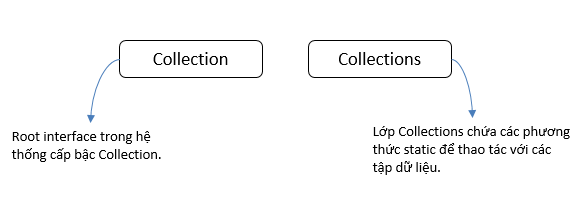
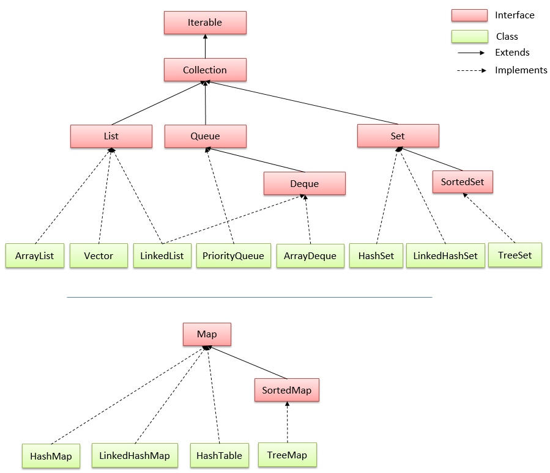
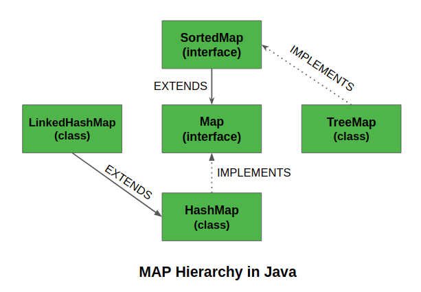
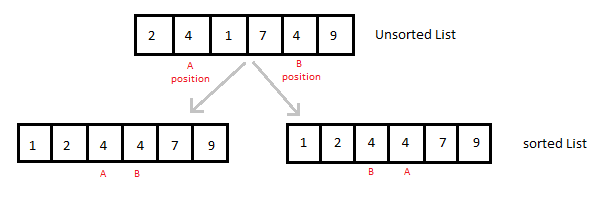

 #  [JAVA] BUỔI 8: CẤU TRÚC DỮ LIỆU TRONG JAVA
 
- [1: Cấu trúc dữ liệu là gì, sử dụng khi nào?](#1-cấu-trúc-dữ-liệu-là-gì-sử-dụng-khi-nào)
- [2: Interface Iterable, Collection -> List, Set, Queue.](#2-interface-iterable-collection---list-set-queue)
    - [2.1: Interface Iterable](#21-interface-iterable)
    - [2.2: Collection](#22-collection)
    - [2.3: Một số interface chính của Collection](#23-một-số-interface-chính-của-collection)
- [3: Interface Map, SortedMap -> HashMap, TreeMap](#3-interface-map-sortedmap---hashmap-treemap)
    - [3.1: Map Interface](#31-map-interface)
    - [3.2: SortedMap](#32-sortedmap)
    - [3.3: HashMap](#33-hashmap)
    - [3.4: TreeMap](#34-treemap)
- [4: Sử dụng một số hàm của cấu trúc dữ liệu như sort.](#4-sử-dụng-một-số-hàm-của-cấu-trúc-dữ-liệu-như-sort)

 ***
## 1. Cấu trúc dữ liệu là gì, sử dụng khi nào?

**Khái niệm**

- **Cấu trúc dữ liệu** là cách tổ chức và lưu trữ dữ liệu để chúng có thể được sử dụng và xử lý một cách hiệu quả. Các cấu trúc dữ liệu khác nhau được thiết kế để phục vụ cho các mục đích và yêu cầu cụ thể trong quá trình lập trình. Trong Java, có một số cấu trúc dữ liệu cơ bản được sử dụng thường xuyên. Dưới đây là một số cấu trúc dữ liệu phổ biến trong Java:

***Mảng (Array):***

- Đặc điểm: Là một cấu trúc tuyến tính lưu trữ nhiều phần tử cùng kiểu dữ liệu.

- Sử dụng khi: Cần lưu trữ một tập hợp các phần tử cùng kiểu và cần truy cập chúng thông qua chỉ số.

```
int[] arr = new int[5];
```
***ArrayList:***

- Đặc điểm: Một lớp thuộc gói java.util, cung cấp một mảng động 

- có thể thay đổi kích thước.
Sử dụng khi: Cần một mảng có thể thay đổi kích thước linh hoạt.

```
ArrayList<Integer> list = new ArrayList<>();
```

***Stack và Queue:***

- Đặc điểm: Dùng để lưu trữ dữ liệu theo nguyên tắc Last In First Out (LIFO) cho Stack và First In First Out (FIFO) cho Queue.

- Sử dụng khi: Cần thực hiện các thao tác push/pop cho Stack hoặc enqueue/dequeue cho Queue.

```
Stack<Integer> stack = new Stack<>();
Queue<String> queue = new LinkedList<>();
```

***HashMap:***

- Đặc điểm: Dùng để lưu trữ cặp key-value, với thời gian truy cập nhanh (O(1)).
 
- Sử dụng khi: Cần ánh xạ giữa các giá trị với một key.
```
HashMap<String, Integer> hashMap = new HashMap<>();
```
**Sử dụng:** khi ta muốn lưu một tập hợp gồm nhiều dữ liệu cũng như có những thao tác xử lý với chúng như thêm, bớt, thay đổi, sắp xếp… Tùy vào nhu cầu mà chọn cấu trúc dữ liệu cho phù hợp

## 2. Interface Iterable, Collection -> List, Set, Queue.

### 2.1: Interface Iterable

>*Tài liệu tham khảo*:  [Iterable](https://websitehcm.com/iterable-trong-java/)


- Trong Java, Iterable là một giao diện trong thư viện cơ bản (java.lang) cho phép một đối tượng được lặp qua (iterated) bởi một vòng lặp. Các đối tượng mà có thể được lặp qua là những đối tượng mà implement giao diện Iterable.

- Khái niệm cơ bản về Iterable là một khái niệm quan trọng trong ngôn ngữ lập trình Java. Nó liên quan đến việc duyệt qua các phần tử trong một tập hợp dữ liệu (collection) như mảng, danh sách liên kết, hoặc tập hợp (Set). Iterable cung cấp một cách tiếp cận trừu tượng để truy cập từng phần tử trong tập hợp, mà không cần biết chi tiết cài đặt của tập hợp đó.


```
// thêm
import java.util.ArrayList;
import java.util.Iterator;
import java.util.List;

public class Main{
    public static void main(String[] args) {
        List<Integer> myList = new ArrayList<>();
        myList.add(1);
        myList.add(2);
        myList.add(3);
        myList.add(4);
        Iterator<Integer> interator = myList.iterator();
        while(interator.hasNext())
        {
            System.out.println(interator.next());
        }
    }
}
```

```
// xoá
import java.util.ArrayList;
import java.util.Iterator;
import java.util.List;

public class Main{
    public static void main(String[] args) {
        List<Integer> myList = new ArrayList<>();
        myList.add(1);
        myList.add(2);
        myList.add(3);
        myList.add(4);
        Iterator<Integer> interator = myList.iterator();
        System.out.println(myList);
        while (interator.hasNext())
        {
            Integer element=interator.next();
            if(element %2==0)
                interator.remove();
        }
        System.out.println(myList);
    }
}
```

**Tại sao sử dụng iterable trong java?**

- Tiện dụng: Sử dụng Iterable cho phép lặp qua các phần tử của một đối tượng một cách dễ dàng và thuận tiện bằng cách sử dụng vòng lặp for-each, có thể tận dụng các tính năng của Java.
- Tái sử dụng mã: Sử dụng Iterable cho phép tái sử dụng mã cho việc lặp qua các phần tử trong các đối tượng khác nhau mà implement giao diện Iterable, giúp cho việc phát triển chương trình trở nên nhanh hơn và hiệu quả hơn.
- Tách biệt: Sử dụng Iterable cho phép tách biệt việc lặp qua các phần tử từ việc thao tác với chúng, giúp cho chương trình trở nên dễ dàng hơn để quản lý và bảo trì.
- An toàn dữ liệu: Sử dụng Iterable giúp cho chương trình trở nên an toàn hơn bởi việc cung cấp một cách để lặp qua các phần tử mà không cần truy cập trực tiếp vào các phần tử của đối tượng.

### 2.2: Collection 

>*Tài liệu tham khảo*:  [Collection ](https://viettuts.vn/java-collection)

"Collection" và "Collections" trong java là hai khái niệm khác nhau.

- **Collections trong java** là một khuôn khổ cung cấp một kiến trúc để lưu trữ và thao tác tới nhóm các đối tượng. Tất cả các hoạt động mà bạn thực hiện trên một dữ liệu như tìm kiếm, phân loại, chèn, xóa,... có thể được thực hiện bởi Java Collections.

- **Collection trong java** là một root interface trong hệ thống cấp bậc Collection. Java Collection cung cấp nhiều interface (Set, List, Queue, Deque vv) và các lớp (ArrayList, Vector, LinkedList, PriorityQueue, HashSet, LinkedHashSet, TreeSet vv).



**Hệ thống cấp bậc Collection trong java**
- Gói java.util chứa tất cả các lớp và interface của Collection.



### 2.3: Một số interface chính của Collection:

#### 2.3.1: Set

- Là một collection không thể chứa 2 giá trị trùng lặp. Set được sử dụng để biểu diễn các bộ, chẳng hạn như bộ tú lu khơ, thời khóa biểu của học sinh, các tiến trình đang chạy trên máy tính...

- Các lớp cài đặt của Set gồm:

     - **HashSet** lưu trữ các phần tử của nó trong bảng băm, là cách thực hiện tốt nhất, tuy nhiên nó không đảm bảo về thứ tự các phần tử được chèn vào.
    - **TreeSet** lưu trữ các phần tử của nó trong một cây, sắp xếp các phần tử của nó dựa trên các giá trị của chúng, về cơ bản là chậm hơn HashSet.
    - **LinkedHashSet** được triển khai dưới dạng bảng băm với có cấu trúc dữ liệu danh sách liên kết, sắp xếp các phần tử của nó dựa trên thứ tự chúng được chèn vào tập hợp (thứ tự chèn).
    - **EnumSet** là một cài đặt chuyên biệt để sử dụng với các kiểu enum.
- Các phương thức: `add` , `addAll` , `remove` , `clear`, `contains`, `isEmpty`, `size`, ...

```
import java.util.HashSet;
import java.util.Set;

public class SetExample {
    public static void main(String[] args) {
        // Khởi tạo một đối tượng HashSet
        Set<String> stringSet = new HashSet<>();

        // Thêm phần tử vào Set
        stringSet.add("Java");
        stringSet.add("Python");
        stringSet.add("C++");
        stringSet.add("Java"); // Phần tử trùng lặp, sẽ khôn được thêm vào

        // In ra các phần tử của Set sử dụng vòng lặp for-each
        System.out.println("Các phần tử của Set:");
        for (String element : stringSet) {
            System.out.println(element);
        }

        // Kiểm tra sự tồn tại của một phần tử trong Set
        String searchElement = "Java";
        if (stringSet.contains(searchElement)) {
            System.out.println(searchElement + " có trong Set.");
        } else {
            System.out.println(searchElement + " không có trong Set.");
        }

        // Xóa một phần tử khỏi Set
        String elementToRemove = "Python";
        stringSet.remove(elementToRemove);
        System.out.println(elementToRemove + " đã được xóa khỏi Set.");

        // In ra số lượng phần tử trong Set
        System.out.println("Số lượng phần tử trong Set: " + stringSet.size());

        // Xóa tất cả các phần tử khỏi Set
        stringSet.clear();
        System.out.println("Set sau khi xóa tất cả các phần tử: " + stringSet);
    }
}

```

#### 2.3.2: List

- Là một collection có thứ tự. List có thể chứa các phần tử trùng lặp. Thường có quyền kiểm soát chính xác vị trí các phần tử được chèn vào và có thể truy cập chúng bằng chỉ số (vị trí của chúng).
- Các phương thức của interface List trong Java bao gồm add, addAll, get, set, remove, clear, contains, isEmpty, size, subList, ...
- Các lớp cài đặt của List trong Java bao gồm
    - ArrayList
    - LinkedList
    - Stack
    - Vector.

```
import java.util.ArrayList;
import java.util.List;

public class ListExample {
    public static void main(String[] args) {
        // Khởi tạo một đối tượng ArrayList
        List<String> stringList = new ArrayList<>();

        // Thêm phần tử vào List
        stringList.add("Java");
        stringList.add("Python");
        stringList.add("C++");
        stringList.add("Java"); // Phần tử có thể trùng lặp

        // In ra các phần tử của List sử dụng vòng lặp for-each
        System.out.println("Các phần tử của List:");
        for (String element : stringList) {
            System.out.println(element);
        }

        // Lấy và in ra phần tử tại một vị trí cụ thể
        int index = 1;
        System.out.println("Phần tử tại vị trí " + index + ": " + stringList.get(index));

        // Kiểm tra sự tồn tại của một phần tử trong List
        String searchElement = "Java";
        if (stringList.contains(searchElement)) {
            System.out.println(searchElement + " có trong List.");
        } else {
            System.out.println(searchElement + " không có trong List.");
        }

        // Xóa một phần tử khỏi List
        String elementToRemove = "Python";
        stringList.remove(elementToRemove);
        System.out.println(elementToRemove + " đã được xóa khỏi List.");

        // In ra số lượng phần tử trong List
        System.out.println("Số lượng phần tử trong List: " + stringList.size());

        // Xóa tất cả các phần tử khỏi List
        stringList.clear();
        System.out.println("List sau khi xóa tất cả các phần tử: " + stringList);
    }
}

```

#### 2.3.3: Queue

- Trong hàng đợi (trong Queue), các phần tử được lưu trữ và truy cập theo cách nhập trước, xuất trước (FIFO - First In First Out)
- Các lớp cài đặt của Queue bao gồm:
    - ArrayDeque
    - LinkedList
    - PriorityQueue
- Một số phương thức thường được sử dụng của Queue:
    - add(): Chèn phần tử đã chỉ định vào hàng đợi.
    - peek() - Trả về đầu của hàng đợi. Trả về null nếu hàng đợi trống.
    - poll() - Trả về và loại bỏ phần đầu của hàng đợi

```
import java.util.ArrayDeque;
import java.util.LinkedList;
import java.util.PriorityQueue;
import java.util.Queue;

public class QueueExample {
    public static void main(String[] args) {
        // Sử dụng ArrayDeque làm Queue
        Queue<String> arrayDequeQueue = new ArrayDeque<>();
        operateQueue(arrayDequeQueue, "ArrayDeque");

        // Sử dụng LinkedList làm Queue
        Queue<String> linkedListQueue = new LinkedList<>();
        operateQueue(linkedListQueue, "LinkedList");

        // Sử dụng PriorityQueue làm Queue
        Queue<Integer> priorityQueue = new PriorityQueue<>();
        operatePriorityQueue(priorityQueue);
    }

    // Thực hiện các thao tác cơ bản trên Queue
    private static void operateQueue(Queue<String> queue, String queueType) {
        System.out.println("Operations on " + queueType + " Queue:");

        // Thêm phần tử vào hàng đợi
        queue.add("Element 1");
        queue.add("Element 2");
        queue.add("Element 3");

        // Hiển thị đầu hàng đợi (không loại bỏ)
        System.out.println("Peek: " + queue.peek());

        // Loại bỏ và hiển thị phần tử đầu hàng đợi
        System.out.println("Poll: " + queue.poll());

        // Hiển thị đầu hàng đợi sau khi poll
        System.out.println("Peek after poll: " + queue.peek());

        // Hiển thị toàn bộ hàng đợi
        System.out.println("Queue contents: " + queue);
        System.out.println();
    }

    // Thực hiện các thao tác trên PriorityQueue
    private static void operatePriorityQueue(Queue<Integer> priorityQueue) {
        System.out.println("Operations on PriorityQueue:");

        // Thêm phần tử vào hàng đợi
        priorityQueue.add(3);
        priorityQueue.add(1);
        priorityQueue.add(2);

        // Hiển thị đầu hàng đợi (không loại bỏ)
        System.out.println("Peek: " + priorityQueue.peek());

        // Loại bỏ và hiển thị phần tử đầu hàng đợi
        System.out.println("Poll: " + priorityQueue.poll());

        // Hiển thị đầu hàng đợi sau khi poll
        System.out.println("Peek after poll: " + priorityQueue.peek());

        // Hiển thị toàn bộ hàng đợi
        System.out.println("PriorityQueue contents: " + priorityQueue);
    }
}

```

### 3: Interface Map, SortedMap -> HashMap, TreeMap.

#### 3.1: Map Interface
>*Tài liệu tham khảo*:  [Map Interface ](https://gpcoder.com/2632-map-interface-trong-java/)

- Trong java, map được sử dụng để lưu trữ và truy xuất dữ liệu theo cặp khóa (key) và giá trị (value). Mỗi cặp key và value được gọi là entry.

- Map chỉ chứa các giá trị key duy nhất, không  chứa các key trùng lặp.

- Các lớp cài đặt (implements) Map interface là HashMap, LinkedHashMap and TreeMap.

    - **HashMap** không đảm bảo thứ tự các entry được thêm vào.
    - **LinkedHashMap** đảm bảo thứ tự các entry được thêm vào.
    - **TreeMap** duy trình thứ tự các phần tử dựa vào bộ so sánh Comparator.

- Sức chứa (compacity) mặc định khi khởi tạo map là 24 = 16. Kích thước này sẽ tự động tăng gấp đôi mỗi khi thêm phần tử vượt quá kích thước của nó.

Ví dụ:

```
public class Main {
    public static void main(String[] args) {
        Map<Integer, String> map = new TreeMap<>();
        map.put(1, "A");
        map.put(5, "E");
        map.put(3, "C");
        System.out.println(map.keySet()); // [1, 3, 5]
    }
}

```

### 3.2: SortedMap 

>*Tài liệu tham khảo*:  [SortedMap](https://shareprogramming.net/tim-hieu-sortedmap-interface-trong-java/)

- SortedMap là một interface trong collection framework. Nó là một interface thừa kế từ Map interface có đầy đủ các chức năng mà Map định nghĩa, ngoài ra các phần tử trong SortedMap sẽ được sắp xếp theo thứ tự của key, mà một trong những implementation điển hình của nó là TreeMap.



- Đặc điểm chính của SortedMap là nó sắp xếp thứ tự các key theo thứ tự tự nhiên của chúng hoặc một bộ triển khai so sánh các key được chỉ định. Vì vậy, hãy cân nhắc sử dụng TreeMap khi bạn muốn có một Map đáp ứng các tiêu chí sau:

    - Key hoặc value đều không được NULL.
    - Các key được sắp xếp theo thứ tự tự nhiên hoặc theo một bộ so sánh được chỉ định cụ thể.

### 3.3: HashMap

- Lớp **HashMap trong Java** là một lớp triển khai của Map Interface trong Collections Framework nên nó sẽ có một vài đặc điểm và phương thức tương đồng với Map.

- **Một số đặc điểm:**

    - HashMap lưu trữ dữ liệu dưới dạng cặp key và value.
    - Chứa các key duy nhất.
    - Có thể có 1 key là null và nhiều giá trị null.
    - Duy trì các phần tử KHÔNG theo thứ tự.

```
import java.util.HashMap;
import java.util.Map;

public class HashMapExample {
    public static void main(String[] args) {
        // Khởi tạo một đối tượng HashMap
        Map<String, Integer> hashMap = new HashMap<>();

        // Thêm phần tử vào HashMap
        hashMap.put("Java", 1);
        hashMap.put("Python", 3);
        hashMap.put("C++", 2);

        // In ra toàn bộ HashMap sử dụng vòng lặp for-each
        System.out.println("Các phần tử của HashMap:");
        for (Map.Entry<String, Integer> entry : hashMap.entrySet()) {
            System.out.println(entry.getKey() + ": " + entry.getValue());
        }

        // Kiểm tra sự tồn tại của một key trong HashMap
        String keyToCheck = "Java";
        if (hashMap.containsKey(keyToCheck)) {
            System.out.println(keyToCheck + " có trong HashMap với giá trị: " + hashMap.get(keyToCheck));
        } else {
            System.out.println(keyToCheck + " không có trong HashMap.");
        }

        // Xóa một phần tử khỏi HashMap
        String keyToRemove = "Python";
        hashMap.remove(keyToRemove);
        System.out.println(keyToRemove + " đã được xóa khỏi HashMap.");

        // In ra số lượng phần tử trong HashMap
        System.out.println("Số lượng phần tử trong HashMap: " + hashMap.size());

        // Xóa tất cả các phần tử khỏi HashMap
        hashMap.clear();
        System.out.println("HashMap sau khi xóa tất cả các phần tử: " + hashMap);
    }
}

```

### 3.4: TreeMap

- **:ớp TreeMap**:là một lớp triển khai của SortedMap, SortedMap kế thừa Map interface. Nên nó sẽ có một vài đặc điểm và phương thức tương đồng với Map và SortedMap.

**Một số đặc điểm:**

 - TreeMap lưu trữ dữ liệu dưới dạng cặp key và value.
 - Chứa các key duy nhất.
 - KHÔNG cho phép bất kỳ key nào là null và nhưng có thể có nhiều giá trị null.
 - Duy trì các phần tử được thêm vào theo thứ tự key tăng dần.

- Dưới đây là một ví dụ Java về cách sử dụng TreeMap, một cài đặt của SortedMap trong Java Collections Framework:

```
import java.util.TreeMap;
import java.util.Map;

public class TreeMapExample {
    public static void main(String[] args) {
        // Khởi tạo một đối tượng TreeMap
        TreeMap<String, Integer> treeMap = new TreeMap<>();

        // Thêm phần tử vào TreeMap
        treeMap.put("Java", 1);
        treeMap.put("Python", 3);
        treeMap.put("C++", 2);

        // In ra toàn bộ TreeMap sử dụng vòng lặp for-each
        System.out.println("Các phần tử của TreeMap:");
        for (Map.Entry<String, Integer> entry : treeMap.entrySet()) {
            System.out.println(entry.getKey() + ": " + entry.getValue());
        }

        // Lấy và in ra phần tử tại vị trí đầu tiên của TreeMap
        Map.Entry<String, Integer> firstEntry = treeMap.firstEntry();
        System.out.println("Phần tử đầu tiên của TreeMap: " + firstEntry.getKey() + ": " + firstEntry.getValue());

        // Lấy và in ra phần tử tại vị trí cuối cùng của TreeMap
        Map.Entry<String, Integer> lastEntry = treeMap.lastEntry();
        System.out.println("Phần tử cuối cùng của TreeMap: " + lastEntry.getKey() + ": " + lastEntry.getValue());

        // Lấy và in ra phần tử nhỏ hơn key được chỉ định trong TreeMap
        String keyToSearch = "Java";
        Map<String, Integer> headMap = treeMap.headMap(keyToSearch);
        System.out.println("Phần tử nhỏ hơn key '" + keyToSearch + "': " + headMap);

        // Lấy và in ra phần tử lớn hơn hoặc bằng key được chỉ định trong TreeMap
        Map<String, Integer> tailMap = treeMap.tailMap(keyToSearch);
        System.out.println("Phần tử lớn hơn hoặc bằng key '" + keyToSearch + "': " + tailMap);
    }
}

```
- Trong ví dụ này, **TreeMap** được sử dụng để triển khai **SortedMap**. Chúng ta thực hiện các thao tác cơ bản như thêm, in ra, lấy phần tử tại vị trí đầu tiên và cuối cùng, cũng như lấy các phần tử nhỏ hơn và lớn hơn một key được chỉ định trong TreeMap. Lưu ý rằng TreeMap tự động sắp xếp các phần tử theo thứ tự tăng dần của key.


## 4: Sử dụng một số hàm của cấu trúc dữ liệu như sort.

>*Tài liệu tham khảo*:  [thamkhao](https://viettuts.vn/java-collection/sorting-trong-collections)

**Lớp Collections trong java** cung cấp các phương thức static để sắp xếp các phần tử của collection. Nếu các phần tử collection thuộc kiểu Set hoặc Map, chúng ta có thể sử dụng TreeSet hoặc TreeMap. Nhưng chúng ta không thể sắp xếp các phần tử của List. Collections cung cấp phương thức sort() để phân sắp xếp các phần tử của List.



